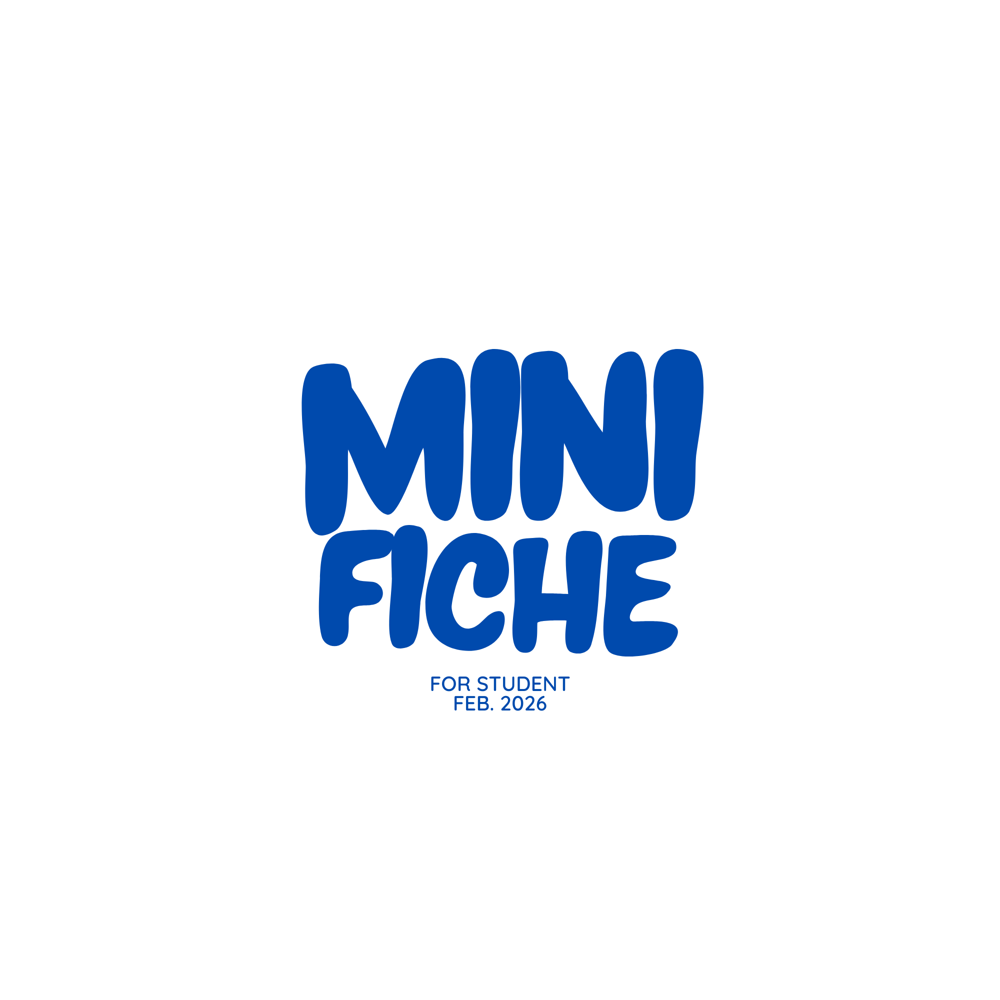

<p align="center">
  
</p>

# Mini Fiche

Application web qui transforme automatiquement vos cours (PDF/DOCX) en fiches de révision Word claires et structurées, grâce à l'IA.

## Comment ça marche

1. **Upload** — Vous déposez votre cours (PDF ou DOCX)
2. **Analyse** — L'app extrait la structure (titres, chapitres, sous-parties)
3. **Résumé** — L'IA résume chaque section en conservant la hiérarchie des titres
4. **Téléchargement** — Vous récupérez une fiche Word avec sommaire cliquable

## Stack technique

| Composant | Technologie |
|-----------|-------------|
| Frontend | HTML, CSS, JavaScript (EJS + Express.js) |
| Backend | Python (Flask) |
| Parsing PDF | PyMuPDF (fitz) |
| Parsing DOCX | python-docx |
| Génération Word | python-docx |
| IA | OpenRouter (Gemini Flash) |

## Installation

### Prérequis
- Python 3.10+
- Node.js 18+
- Une clé API [OpenRouter](https://openrouter.ai/)

### Setup

```bash
# Cloner le projet
git clone https://github.com/brayedna/mini-fiche.git
cd mini-fiche

# Backend
python -m venv venv
source venv/bin/activate
pip install -r backend/requirements.txt

# Frontend
cd frontend
npm install
cd ..

# Configuration
cp .env.example .env
# Ajouter votre clé API OpenRouter dans .env
```

### Lancement

```bash
# Terminal 1 — Backend
source venv/bin/activate
python -m backend.app

# Terminal 2 — Frontend
cd frontend
node server.js
```

L'app est accessible sur `http://localhost:3000`

## Fonctionnalités

- Support PDF et DOCX
- Détection automatique de la structure (sommaire PDF ou détection par IA)
- 3 niveaux de détail (concis, normal, détaillé)
- Sommaire Word cliquable avec liens internes
- Titres colorés et hiérarchisés
- Traitement parallèle des gros documents (4 workers)
